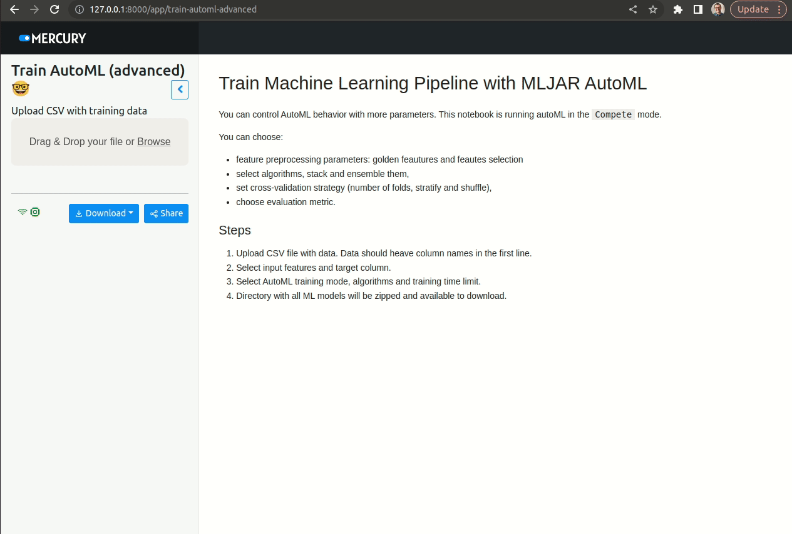
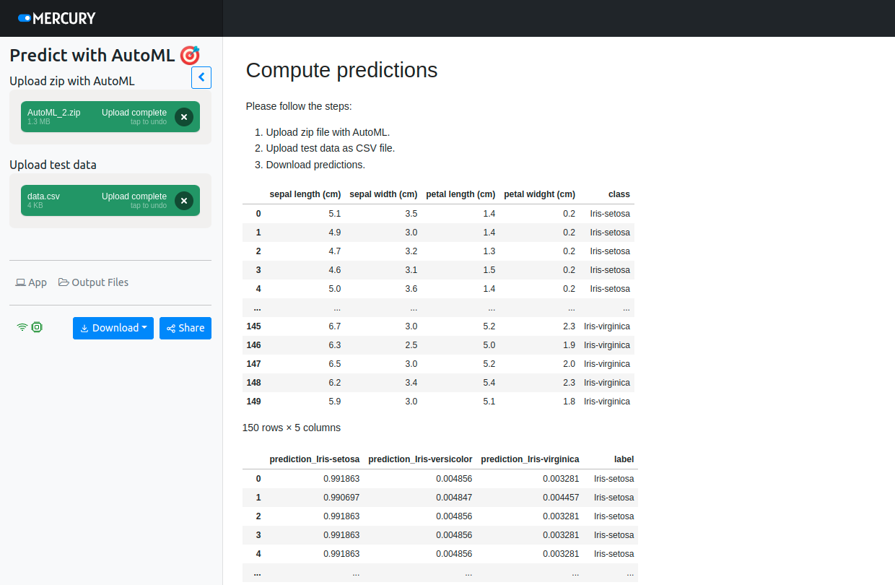
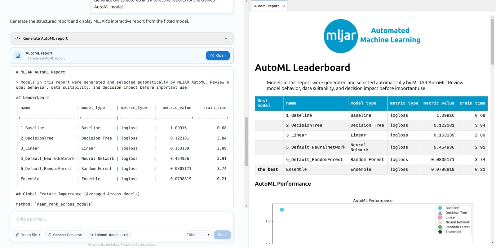
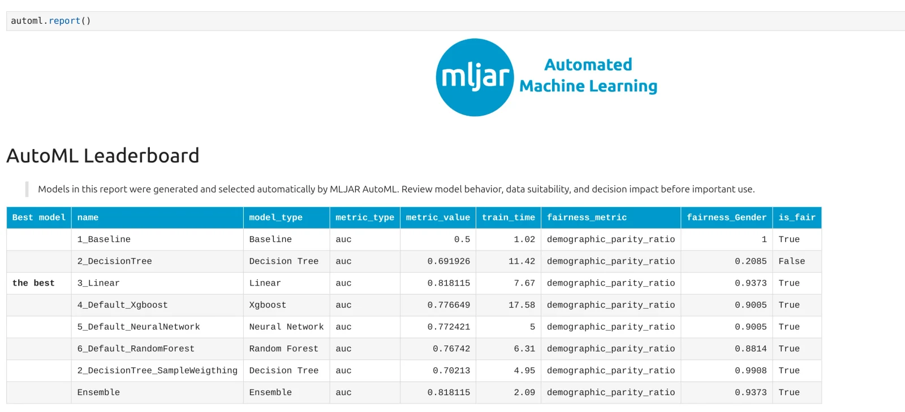
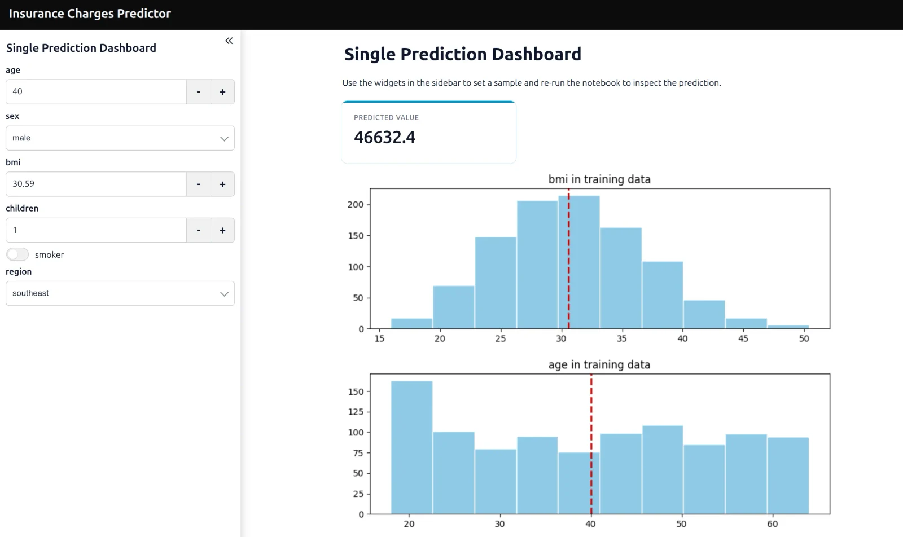
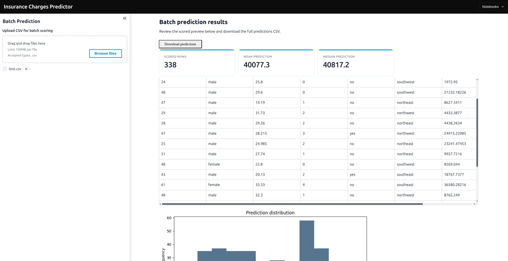

# AutoML Web App

Train machine learning models from a CSV file, inspect the results, and download a model archive for batch predictions. This repository turns three Jupyter notebooks into browser apps with [Mercury](https://github.com/mljar/mercury), using [MLJAR AutoML (`mljar-supervised`)](https://github.com/mljar/mljar-supervised) for training.

[MLJAR AutoML overview](https://mljar.com/automl/) · [Python documentation](https://supervised.mljar.com/) · [MLJAR Studio](https://mljar.com/studio/)


[Watch the demo video](https://github.com/mljar/automl-app/assets/6959032/3363631a-2187-44cd-94a8-3cbd5418de98).

## Included notebooks

| Notebook | What it does |
| --- | --- |
| [Train AutoML](train-automl.ipynb) | Upload training data, choose features and a target, select a training mode and algorithms, and download trained models. |
| [Advanced training](train-automl-advanced.ipynb) | Configure Golden Features, feature selection, algorithms, stacking, ensembles, cross-validation, and the evaluation metric. |
| [Batch predictions](automl-predict.ipynb) | Load a model ZIP archive, upload a CSV of input data, and download `predictions.csv`. |

The training notebooks display an AutoML report and export the experiment directory as a ZIP archive. Depending on the selected settings, AutoML handles preprocessing, model selection, tuning, and explanations.

## Run locally

Clone the repository and run the commands from its root directory:

```bash
git clone https://github.com/mljar/automl-app.git
cd automl-app
python -m venv .venv
```

Activate the environment on macOS or Linux:

```bash
source .venv/bin/activate
```

On Windows PowerShell:

```powershell
.venv\Scripts\Activate.ps1
```

Install the dependencies and start Mercury:

```bash
python -m pip install -r requirements.txt
mercury run
```

Open the local address printed by Mercury and choose a notebook. Use a Python version supported by the installed packages; see the [AutoML installation guide](https://supervised.mljar.com/#installation) and [Mercury documentation](https://runmercury.com/docs/).

## Train a model

1. Open **Train AutoML** or **Train AutoML (advanced)**.
2. Upload a CSV with column names in the first row.
3. Select the input features and target column. Exclude the target from the input features.
4. Choose the algorithms and training time limit, then click **Start training**.
5. Review the report and download the ZIP archive from the app output.

The basic notebook offers `Explain`, `Perform`, and `Compete` modes. The advanced notebook uses `Compete` and exposes additional controls for feature engineering, validation, and model combination.



## Make batch predictions

1. Open **Predict with AutoML**.
2. Upload the ZIP archive downloaded after training.
3. Upload a CSV containing the input features used for training, with matching column names and order.
4. Inspect the predictions and download `predictions.csv`.

The prediction notebook reloads the saved experiment and calls `automl.predict_all()` on the uploaded data.



## Adjust upload and training limits

Both training notebooks set a **1 MB** upload limit. Edit this cell to change it:

```python
data_file = mr.File(label="Upload CSV with training data", max_file_size="1MB")
```

The training time choices are **60, 120, 240, and 300 seconds**. Edit the selector to add a larger budget, for example:

```python
time_limit = mr.Select(
    label="Time limit (seconds)",
    value="300",
    choices=["60", "120", "240", "300", "600", "1200"],
)
```

Save the notebook and reload the app after changing its controls.

## Explore the current AutoML workflow

[MLJAR AutoML](https://mljar.com/automl/) supports tabular classification and regression. The Python package provides four training modes: `Explain`, `Perform`, `Compete`, and `Optuna`. Reports and explanations depend on the task and configuration; `Optuna` is not exposed in this repository’s notebook controls.

For an AI-assisted workflow, use [MLJAR Studio](https://mljar.com/studio/) to prepare and run training while keeping the Python code editable. Start with the [AutoML Python tutorial](https://mljar.com/tutorials/automl-python/) or inspect the [employee attrition and fairness walkthrough](https://mljar.com/tutorials/automl-hr-employee-attrition-fairness-report/).



*AutoML training and reports in MLJAR Studio.*

[](https://mljar.com/tutorials/automl-hr-employee-attrition-fairness-report/)

*Example report from the employee attrition tutorial; results depend on your dataset and training settings.*

## Share a prediction app

The current AutoML package can generate a Mercury prediction app with `automl.app()`. See the [prediction app tutorial](https://mljar.com/blog/web-app-machine-learning/) for generation and publishing, or [self-host Mercury with Docker](https://runmercury.com/deploy/dockerfile/). [MLJAR Platform](https://platform.mljar.com/) provides managed hosting.





*Prediction app examples from the [MLJAR AutoML page](https://mljar.com/automl/), generated with the current AutoML package.*

## More resources

- [Structured reports for Python and AI workflows](https://mljar.com/blog/structured-automl-reports-python-llm/)
- [AutoML source code](https://github.com/mljar/mljar-supervised)
- [Mercury documentation](https://runmercury.com/docs/)
- [Research applications](https://mljar.com/research/)

## Community

Report problems or share ideas in [GitHub Issues](https://github.com/mljar/automl-app/issues). Follow [MLJAR on Twitter](https://twitter.com/MLJAROfficial), [Aleksandra on LinkedIn](https://www.linkedin.com/in/aleksandra-p%C5%82o%C5%84ska-42047432/), or [Piotr on LinkedIn](https://www.linkedin.com/in/piotr-plonski-mljar/).

## License

This repository is available under the [MIT license](LICENSE). MLJAR Studio and managed hosting have separate plans.
